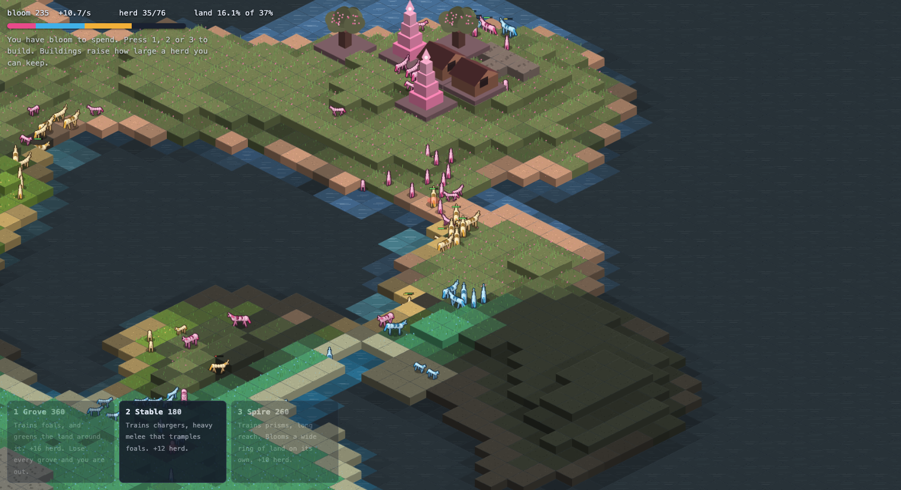
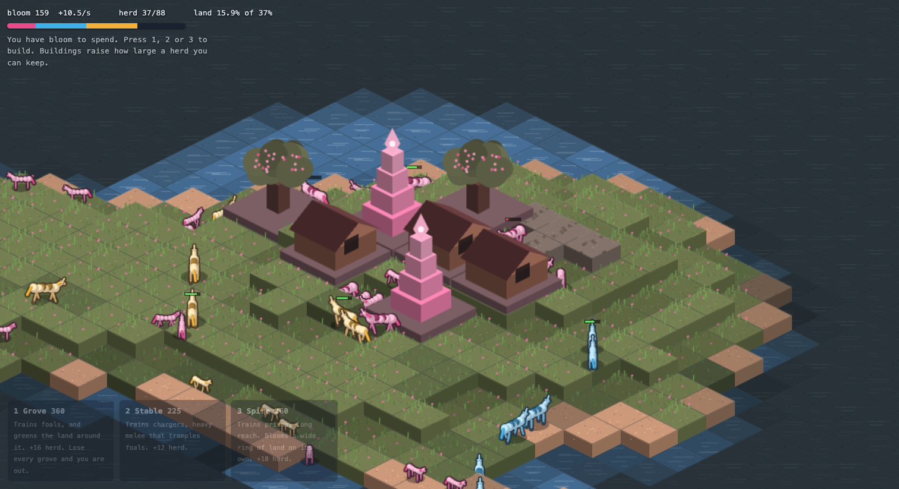
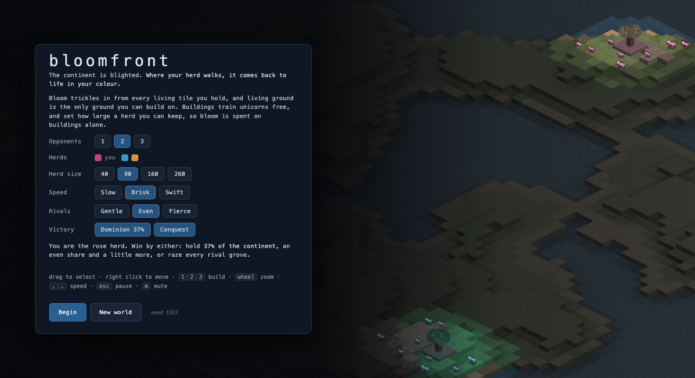

# bloomfront

An isometric real-time strategy game that fits in 13 kilobytes, built for [js13kGames 2026](https://js13kgames.com/2026/).



Open `index.html` in any modern browser. Nothing to install, nothing to build, no server needed.

## The game

You lead a herd of unicorns across a continent that has been drained grey. Ground comes back to life wherever your unicorns walk, in your colour. Living ground is your income and the only place you can build, so growing means spreading out across the map.

One to three rival herds are doing the same in their own colours. Where two herds meet, the ground bleaches back to grey before it changes hands.

You win by holding enough of the continent, or by destroying every rival grove. Both conditions can be turned off before you start.

## Controls

```
drag                  select units
right click           move there, or attack the building you clicked
1 2 3                 place a grove, stable or spire
shift                 hold while placing to keep building
esc                   cancel a placement, then pause
p                     pause
r                     restart
, .                   slow down, speed up
m                     mute
wasd or middle drag   pan
wheel                 zoom
```

## Units and buildings



A **grove** trains foals, which are fast, cheap and the best at spreading colour. Losing every grove can lose you the game.

A **stable** trains chargers, which are slow and hit hard.

A **spire** trains prisms, which shoot from a long way off and bring ground back to life around themselves.

Chargers beat foals, prisms beat chargers, foals beat prisms. Attacking from higher ground does more damage.

Buildings need a flat two by two patch of living ground you already own. Each one you add raises how many unicorns you can keep, and each costs more than the last of its kind.

## Setting up a game



The lobby lets you choose the number of opponents, how large herds can grow, the speed of the game, how hard the rivals play, and which victory conditions apply. It draws over the map you are about to play, and a new world can be rolled until you like the look of one.

## Building from source

```
npm install
npm run pack     writes dist/bloomfront.zip
npm test         runs the checks
```

Requires node.
